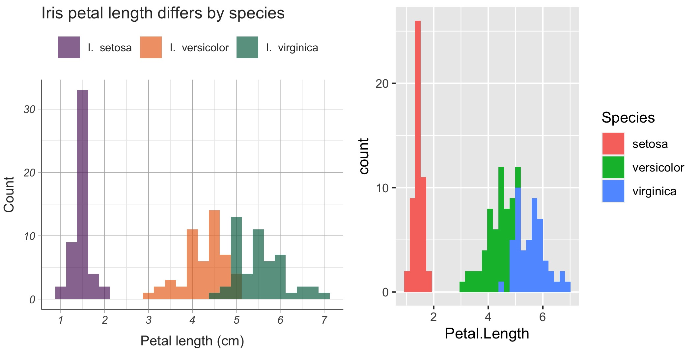

```{r setup, include = FALSE}
knitr::opts_chunk$set(echo = TRUE, warning = FALSE, message = FALSE, fig.align = "center")
```

_This tutorial reflects my own inexpert, somewhat aesthetically impaired opinions. Proceed at your own peril._ 

A key part of our job as research scientists is to communicate our findings to a broader audience, including through papers, presentations, and conference posters. This means we routinely make and re-make figures which illustrate our work and any uncertainties associated with it. Data visualisation is a part of data science that we all engage with, regardless of our field of expertise.

Making figures shouldn't be painful and confusing. Instead, it should be something we approach systematically and with a level of confidence. With this tutorial, I want to introduce you to my favourite data visualisation tool, `ggplot2`, and also to the way I think about building and refining figures.

This tutorial has three main parts. First we discuss the layered *grammar of graphics*, which is a systematic way of thinking about the components of a figure. This part is code-free, but should hopefully help make sense of the code to come. In the second part, we go through the core features of `ggplot2`, and how we can leverage these to make versatile, complex data visualisations. Finally, we talk about figure refinement, from changing axis labels to image size and resolution. I should warn you that in this last part I'm at my least authoritative and nevertheless most opinionated. But before we jump into it, let's set up.

# Materials and set-up

This tutorial is for you if you have some experience with `R`, even if only a little. You don't need any prior experience with `ggplot2` specifically, or with the wider `tidyverse` ecosystem. 

You need an up-to-date version of `R` installed, and I thoroughly recommend working in the RStudio IDE. This R Markdown notebook was written in `R 4.1.3`. 

This tutorial will use two `R` packages: [`tidyverse`](https://www.tidyverse.org/) and [`cowplot`](https://wilkelab.org/cowplot/index.html). The former contains `ggplot2` in addition to a number of other data science packages. The latter is an add-on to `ggplot2`, designed to make publication-ready figures. We will use it in Part III. You can install or update packages in the usual way if you need to.
```{r install, eval = FALSE}
install.packages("tidyverse")
install.packages("cowplot")
```

Once you have everything installed and updated, we need to load the packages.
```{r packages}
library("tidyverse")
library("cowplot")
```

Finally, it's hard to talk about data visualisation without any data. Throughout, we will use [Fisher's iris data set](https://en.wikipedia.org/wiki/Iris_flower_data_set). This famous toy data set contains petal and sepal measurements obtained from 150 individual flowers across three iris species. It might be familiar to you from other workshops and tutorials, but don't worry if not. We can load it and take a look.

```{r load_iris_data}
data(iris)
head(iris)
```

Above, `iris` is a data frame containing 150 observations (rows) of 5 variables (columns). The first four variables correspond to the flower measurements and are numeric, and the last one, `Species` is a factor, taking one of three values: `"setosa"`, `"versicolor"` or `"virginica"`. Data analysis and visualisation in `R` rely heavily on this data frame structure.

# Part I: What is the Grammar of Graphics?

The "gg" in `ggplot2` stands for "grammar of graphics". If the grammar of a language is a way of describing the components of a sentence, e.g. subject, verb, object, and how these all fit together, then a grammar of graphics is a way of describing the components of a plot, e.g. data, axes, shapes. Just like grammar differs from language to language, so it can differ from one data visualisation tool to another. However, when people talk about _the_ grammar of graphics, they usually mean the grammar first described by [Leland Wilkinson](https://link.springer.com/book/10.1007/0-387-28695-0) and later extended and implemented by [Hadley Wickham](https://vita.had.co.nz/papers/layered-grammar.html).

The basic idea behind this grammar is that we can (semi-)independently specify plot features and combine them to create arbitrarily complex figures. The three geatures we must explicitly specify for every `ggplot2` plot are **data**, **aesthetic mapping(s)** and **geometric object(s)**. Other features, usually handled by default in the background, include statistical transformations, scales, faceting, and theme.

Let's illustrate the grammar of graphics. I made the plot below using `ggplot2`, although in principle I could have used base `R`, Excel, Prism, or even drawn it by hand. However a figure has been generated, we can always talk about it in terms of the grammar of graphics, even if we don't see the code used to make it, or if in fact there is no code.

<center>
{width=50%}
</center>

The **data** you see plotted above is the same iris data set I showed you earlier. While you have seen that the full data set contains a number of different variables, only petal length and species are shown here.

The **aesthetic mappings** of the plot link these variables to plot elements like axes, colours, shapes, and sizes. In the plot above, there are two aesthetic mappings: petal length is mapped to the x-axis, and species is mapped to colour (or technically, fill). What about the y-axis? It stands for count, which is not a variable recorded in the data, but is instead a statistical transformation calculated implicitly when making the plot. This is why it doesn't count (pun intended) as an aesthetic mapping. If you are trying to figure out what the aesthetic mappings of a plot are, you need to ask yourself (1) what variables are present in the plot, and (2) how they are represented using axes, colours, and so on.

Finally, **geometric objects** describe the types of common statistical plots you see. They can be things like scatter plots, regression lines, box plots, etc. One of the features which make `ggplot2` so versatile is that it allows us to layer different geometric objects on top of each other to make complex plots. In the example above I used only one geometric object: a histogram. In order to identify the geometric objects in a plot, you have to ask yourself what common different types of plots you can see. Keep in mind there might be more than one!

**Exercise 1: The Grammar of Graphics.** Now that you have an idea of what data, aesthetic mappings, and geometric objects are in the context of the grammar of graphics, why don't you give it a try? Can you identify the different features of the plot below? If you wish to spend longer on this exercise, try doing the same for the figures in the last research article you read. Alternatively, head over to your favourite news website and see if you can find some data visualisations there to practise on. Articles on the climate emergency, demographics, and elections are all good places to look.

<center>
{width=50%}
</center>

# Part II: Creating complex, versatile plots

## Syntax overview

We have discussed the grammar of graphics in theory, but what does it look like in practice? In its simplest form, the code to make a `ggplot2` figure looks something like this:

```{r pseudo_general, eval = FALSE}
ggplot(<data>, aes(<aesthetic mappings>)) +
  geom_<object>()
```

The first line is a `ggplot()` function call, which contains the data and shared aesthetic mappings of the plot. We afterwards add (literally, using a `+` sign) different plot elements, including geometric objects.

The first plot we discussed was a histogram of petal lengths, coloured by iris species. I added a title and used a few other features to customise my plot, but a simple version of the same figure can be generated using:

```{r pseudo_ex1, eval = FALSE}
ggplot(iris, aes(x = Petal.Length, fill = Species)) +
  geom_histogram()
```

Unlike plotting in base `R`, the **data** used in `ggplot()` must be in a data frame format. Like in `iris`, rows should always correspond to samples, and columns should correspond to variables. Luckily for us, this is arguably the most standard way to record data, and you might find a lot of your spreadsheets already look like this.

The reason to insist on this format is that we can then set **aesthetic mappings** by referring to the column names of the data frame. Above, `x = Petal.Length` means that the measurements recorded under `Petal.Length` should go on the x-axis. Similarly, `fill = Species` means that the fill (i.e. inside colour of a 2D object, as opposed to its boundary colour) is determined by values recorded under `Species`.

Finally, the **geometric object** here, affectionately known as the _geom_, is a histogram. Hence `geom_histogram()`. Good code is pretty self-explanatory like that.

There are several differences between the plot I showed you earlier and the "default" plot you will get running the two lines of code above. Let's put them side by side to compare and contrast. The plot on the left is the one I showed you earlier, and the plot on the right is the result of the two lines of code above.

<center>
{width=100%}
</center>

The data, aesthetic mappings, and geometric object in both plots are exactly the same. The differences you see are largely stylistic, and are controlled by some of the additional features of `ggplot2`. Some geoms have extra parameters you can tweak, including **statistical transformations** and **position**. I manually set the histogram bins in my plot to be different from the default, and also made the histograms corresponding to different species overlap instead of stacking on top of each other. I then edited the **scales** of the plot, in order to change the axis labels and histogram colours. I also used a different **theme** which is why the background colours, fonts, and legend positions in the two plots are different. I further added a title to my plot. 

Throughout the rest of the tutorial, we will dig a little deeper into all these plot features. Some things we won't have time to cover in great detail (e.g. colour palettes and creating your own custom themes), but I'll signpost you to other resources.

## Aesthetics

The connection between aesthetic mappings and geometric objects isn't entirely straightforward. They are not independent of each other: we usually specify both the x- and the y-axis for a scatter plot, but only the x-axis for a histogram. But neither are aesthetic mappings necessarily specific to a geom. When we make a complex figure including multiple geoms (e.g. a scatter plot together with a regression line), they might share some aesthetics, such as the x- and y-axis, but not others, such as colour. 

As a general rule, every geom will have some required aesthetics, some optional ones, and some it complains about or ignores. You don't need to know these by heart. Most of the time the obvious things work, and troubleshooting tends to be reasonably straightforward. However, it helps to be aware of the most commonly used aesthetics you can manipulate.

### Axes

The two major aesthetics are the axes, `x` and `y`. Axes can map to both continuous variables, such as `Petal.Length`, or discrete ones, such as `Species`. Note also that aesthetic mappings don't need to map to singular data variables, they can also map to expressions. We might, for example, be interested in the sum of petal length and width. Below is a boxplot which illustrates a discrete x-axis and a continuous y-axis using a more complex variable expression.

``` {r disc_cont}
ggplot(iris, aes(x = Species, y = (Petal.Length + Petal.Width))) +
  geom_boxplot()
```

### Colour and fill

The other most commonly used aesthetics are for `colour` and `fill`. Here colour means specifically the colour of one-dimensional "thin" shapes such as points and lines, as well as the border colour of 2D shapes like bars and tiles. Fill stands for the "inside" colour of bars and tiles, as well as the shading of areas more generally. 

**Exercise 2: Ignoring aesthetics.** In the code below, change `colour` to `fill`. What happens and why do you think it happens? Can you add, remove, or change some of the aesthetic mappings to produce an error message?

``` {r col_ex_point}
ggplot(iris, aes(x = Petal.Length, y = Petal.Width, colour = Species)) +
  geom_point()
```

Two-dimensional geoms such as histograms and boxplots can have both `colour` and `fill` mappings, although usually we want to focus on fill. What happens if you change `fill` to `colour` in the plot below?

``` {r col_ex_hist}
ggplot(iris, aes(x = Petal.Length, fill = Species)) +
  geom_histogram()
```

*** 
Like axes, colours can map to both discrete variables, as above, or to continuous ones using colour gradients. By default low values start in dark blue and gradually turn lighter, but later we'll see how to customise gradients.

``` {r col_ex_point2}
ggplot(iris, aes(x = Petal.Length, y = Petal.Width, colour = Sepal.Length)) +
  geom_point()
```

### Shape and linetype

When making figures, it's always [a good idea](https://www.nature.com/articles/d41586-021-02696-z) to take into account colour blindness, as well as black & white printing. The easiest way to do this is to change the shapes of points and lines. The point shape aesthetic is conveniently called `shape`, and the line type one is, well, `linetype`. Below is an example which uses different colour and shape simultaneously. 

``` {r shape_ex}
ggplot(iris, aes(x = Petal.Length, y = Petal.Width, colour = Species, shape = Species)) +
  geom_point()
```

### Mappings and assignments

So far we've talked about aesthetic mappings, i.e. linking aesthetics to variables (or expressions of variables) in the data. But occasionally you may want to keep aesthetics fixed to a particular value. For example, you might want to make a scatter plot with cornflower blue points, instead of colouring points by species. We can set this using the same aesthetic `colour`, but moving it from the `aes()` call to the geom instead.

``` {r assign_ex_1}
ggplot(iris, aes(x = Petal.Length, y = Petal.Width, shape = Species)) +
  geom_point(colour = "cornflowerblue")
```

This is no longer and aesthetic _mapping_, since we are not mapping any data variables. Instead, it is an aesthetic _assignment_, as we are assigning a fixed value. There are some aesthetics I assign more often than others: `size`, which controls point size and line width, and `alpha` for colour transparency. Transparency is useful when parts of the plot overlap. Setting it to zero will turn the object invisible, and the default value of one makes objects fully opaque. I always experiment with setting `alpha = 0.1` on plots with hundreds or thousands of points. Setting `alpha = 0.5` or similar can be useful when you have overlapping shapes such as bars.

This is just the tip of the iceberg, of course. If you want to learn more about different aesthetics and what values they can take, check out this official documentation [page](https://ggplot2.tidyverse.org/articles/ggplot2-specs.html).

## Geometric objects

So far we have seen three types of geometric objects: histograms `geom_histogram()`, scatter plots `geom_point()` and boxplots `geom_boxplot()`. Listing all geoms is well beyond the scope of this tutorial, and if I'm being honest beyond the scope of my own knowledge. Suffice it to say, there is a geom for just about any type of statistical plot out there. In this section we'll see some more examples of commonly used geoms and how they can be combined.

### Layering geoms

You might have noticed that right at the start I referred to the grammar of graphics as "layered". This refers to our ability to add geoms together and layer them on top of each other. One of the things I frequently do is make violin plots and add small boxplots inside them, to visualise the median and upper and lower quartiles of each distribution.

```{r layer_comb}
ggplot(iris, aes(x = Species, y = Petal.Length)) +
  geom_violin() +
  geom_boxplot(width = .15)
```

If you've ever used an image editing tool like Photoshop, Inkscape, or Gimp, you might be familiar with the concept of layering. It's this idea that when you put opaque images on top of each other, bottom layers are hidden underneath top layers. We can control this by adjusting layer transparency and being careful about how we order things. In `ggplot2`, geoms are layered in the order you type them, i.e. the higher up the geom is in your code, the further back it is in the image. So in the picture above the larger violin plots are behind the smaller boxplots. However, if I swapped the order of the geoms, the boxplots will no longer be visible because they remain hidden behind the violins.

```{r layer_comb_2}
ggplot(iris, aes(x = Species, y = Petal.Length)) +
  geom_boxplot(width = .15) +
  geom_violin()
```

**Exercise 3: Layering.** Another way to make sure background layers are visible is by making foreground layers transparent. Can you edit just the last line of the code above (reordering geoms or adding new ones is not allowed) to make this picture?
```{r layer_comb_3, echo = FALSE}
ggplot(iris, aes(x = Species, y = Petal.Length)) +
  geom_boxplot(width = .15) +
  geom_violin(alpha = 0.5)
```

### Shared and private aesthetics

In the example above, the violin plots and the box plot shared the same aesthetic mappings, namely species for the x-axis and petal length for the y-axis. Axes are usually shared by all geoms in a plot. However, aesthetics don't have to be shared all the time. It's quite common to share some aesthetics and keep others private to specific geoms.

For example, suppose that I wanted to colour the violin plots by species, but keep the boxplots white for contrast. If I add `fill = Species` in my usual `aes()` call, I end up colouring both, which isn't what I set out to do.

```{r share_ex}
ggplot(iris, aes(x = Species, y = Petal.Length, fill = Species)) +
  geom_violin() +
  geom_boxplot(width = .15)
```

This is because anything from the `aes()` call inside the `ggplot()` function gets passed down to all geometric objects underneath. These are what we refer to as shared aesthetics. However, I can add a new `aes()` mapping that is private just to one geom only: it will affect that specific geom, but nothing else. If I set `aes(fill = Species)` to be private to `geom_violin()`, then it wouldn't affect the boxplot, which would remain white by default.

```{r share_ex_2}
ggplot(iris, aes(x = Species, y = Petal.Length)) +
  geom_violin(aes(fill = Species)) +
  geom_boxplot(width = .15)
```

**Exercise 4: Shared and private aesthetics.** I'm not claiming it's a good idea, but can you make the plot below?
```{r share_ex_4, echo = FALSE}
ggplot(iris, aes(x = Species, y = Petal.Length)) +
  geom_violin(aes(colour = Species)) +
  geom_boxplot(width = .15, aes(fill = Species))
```

### Statistical transformations

Data visualisation is ultimately a branch of statistics and like all branches of statistics, it (unfortunately) requires calculations, done if not by us then by the computer. And different types of plots, i.e. different geoms, require different calculations.

A scatter plot `geom_point()` is easy: we take the data as it is, no maths necessary. A histogram `geom_histogram()` is, however, more involved: we need to decide how to bin the data, and then count how many points fall in each bin. We might want to set parameters like binwidth or breakpoints in a histogram. In order to get the right height and shape boxplot `geom_boxplot()` we need to calculate the median and interquartile range of the data, instead of binning it. A violin plot `geom_violin()` may intuitively feel like a type of boxplot, but the maths behind it is different still: instead of quartiles, the shape of the distribution is estimated. Different geoms then require different _statistical transformations_.

#### Stats

_Things get a little abstract and esoteric in this section, apologies for which. Don't worry if you find this next bit confusing: it concerns_ `ggplot2` _features that are perhaps good to know, but that you're unlikely to need._ 

Every geom has a default corresponding stat. There are properly `stat_*()` functions that handle the necessary statistical transformations, but for the purposes of this tutorial we'll think of them as parameters of the `geom_*()` function. Since in `geom_point()` we leave the data as-is, its stat is `stat = "identity"`. In histograms, the default stat is `stat = "bin"`, because we need to bin the data. Other examples include `stat = "density"` for density plots and the rather mysterious `stat = "smooth"` for fitted lines and curves.

What happens if we try to change the `stat` away from the default? Let's try. Below, I've used `geom_line()` but with the same stat that histograms require, `stat = "bin"`.

```{r alt_stats}
ggplot(iris, aes(x = Petal.Length)) +
  geom_line(stat = "bin")
```

What we end up with looks a bit like a histogram, except made of lines instead of bars. The formal name for this type of plot is a _frequency polygon_ and it has its own geom, `geom_freqpoly()`. Try it out! How come `geom_line()` produced an almost-histogram? It's because in `ggplot2`, the stat controls the calculation (in this case binning data), and the geom controls the way it's visualised (in this case using lines).

Is changing stats ever actually useful? Yes, albeit very rarely. In the example above, there was simply another, better geom. Most of the time, you'll find there is already a geom best suited to the stat you want. Still, understanding stats is important! It makes navigating `ggplot2` documentation easier, for one, especially as you look for other parameters you can adjust.

**Exercise 5: Geoms and stats.** You might be forgiven if you assume that `geom_line()` by default fits a regression line to the data. However, it does something rather different. What is its default stat and how does it explain the figure you see? When might you want to use `geom_line()`? 
```{r ex_5_stats, eval = FALSE}
ggplot(iris, aes(x = Petal.Length, y = Petal.Width)) +
  geom_line()
```

#### Additional parameters

Geoms have additional parameters you can tweak, some of which they inherit from the underlying stat. We used one such parameter earlier: `width` can make things like boxplots and bars narrower. Try varying the value of width below to see what happens.

```{r change_width, eval = FALSE}
ggplot(iris, aes(x = Species, y = Petal.Length)) +
  geom_violin() +
  geom_boxplot(width = 0.15)
```

While `width` above changes how the boxes look, it doesn't affect the underlying stat calculation. However, a lot of parameters do. Take histograms for example. Throughout this tutorial you might have seen the following message every time you've made a histogram:
`` `stat_bin()` using `bins = 30`. Pick better value with `binwidth` ``.

This is because `geom_histogram()` quietly calls `stat_bin()` to do the necessary calculations, and by default `stat_bin()` creates 30 equally-sized bins for the data. We could override that default in several ways. We can change `binwidth`, like the message suggests. We could also set the number of bins with `bins`, or even manually fix the bin boundaries with `breaks`. Note that while technically these are all used by the `stat_bin()` function, we put them directly in `geom_histogram()` without explicitly referencing the stat. 

```{r hist_breaks, eval = FALSE}
ggplot(iris, aes(x = Petal.Length)) +
  geom_histogram(breaks = 0:8)
```

**Exercise 6: Stat parameters.** We can also set stat parameters within alternative geoms. Can you make the figure below using `geom_line()`?
```{r histline__breaks, echo = FALSE}
ggplot(iris, aes(x = Petal.Length)) +
  geom_line(stat = "bin", breaks = 0:8)
```

___
In addition to making histograms, the other useful geom (or equivalently stat!) to know how to tweak is `geom_smooth()`. By default, this fits a curve through the data.

```{r smooth_default}
ggplot(iris, aes(x = Petal.Length, y = Petal.Width)) +
  geom_point() +
  geom_smooth()
```

The blue curve is the fitted model, and the grey band is its 95% confidence interval. The model in question is LOESS, a kind of local polynomial regression that you might not be familiar with, or that might not be relevant to the statistical analysis you actually do on your data. Much more often, we want to specify a linear model instead, which we can do by setting `method = "lm"`.

By default, a linear model plotted like that fits `lm(y ~ x)`. However, we can further specify the formula if we wanted to. Note the `formula` parameter uses the aesthetics we have mapped (in this case the axes `x` and `y`), not the data variable names. We can also hide the confidence interval by setting `se = FALSE` or make it narrower by setting another value, e.g. `level = .90` for a 90% confidence interval. The code below changes the formula and the confidence interval width. What happens if you also add `se = FALSE`?

```{r smooth_lm_spec}
ggplot(iris, aes(x = Petal.Length, y = Petal.Width)) +
  geom_point() +
  geom_smooth(method = "lm", formula = y ~ sqrt(x), level = .90)
```

**Exercise 7: Regression lines.** We are slowly working towards making the figures from the start of this tutorial. Can you make the plot below? The shade of grey used instead of the default blue for the fitted line is `"grey70"`. As an additional challenge, can you also change the colour of the confidence interval band?

```{r share_ex_7, echo = FALSE}
ggplot(iris, aes(x = Petal.Length, y = Petal.Width)) +
  geom_smooth(method = "lm", colour = "grey70") +
  geom_point(aes(colour = Species))
```

### Position

In addition to having a stat, which handles relevant calculations, geoms also have a _position_, which ostensibly handles what happens when parts of the geom overlap. This usually happens when we have overlapping data points, and it often comes up in histograms. 

Let's put the iris data set to one side for a moment and illustrate with some fake data. The code below creates a data frame `df` containing 16 samples. Each sample has a value (either one or two) and a label (either A or B).

```{r}
df <- data.frame(value = rep(1:2, 8),
                 label = rep(c("A", "B"), times = c(10, 6)))
```

The values are equally split between one and two, but there are more A's than B's. The data can be summarised like so:
```{r summarise_df}
table(df)
```

Let's make a histogram of the data, colouring it by label. The default position of histograms is `position = "stack"`, meaning equal values appear on top of each other. This is why we see two columns on top of each other, each of height eight. Note that I've set the transparency to `alpha = 0.5` so you can convince yourself there is no overlap.

```{r}
ggplot(df, aes(x = value, fill = label)) +
  geom_histogram(alpha = 0.5)
```

However, sometimes when we plot histograms and colour them by a category (be that label or species), we do want them to overlap instead of stack. To achieve this, we set `position = "identity"`. This way, the two columns are of size five (for A) and three (for B). I have again set the transparency to `alpha = 0.5`. What happens if you change the transparency?

```{r pos_identity}
ggplot(df, aes(x = value, fill = label)) +
  geom_histogram(position = "identity", alpha = 0.5)
```

We might also want to plot the data side by side using `position = "dodge"`. This is rather ill-advised for histograms, but it can be very useful in bar charts `geom_bar()` and column charts `geom_col()`. Note in the example below, I also made the continuous `value` discrete using `factor()`. Unlike histograms, (good) bar charts have discrete x-axes. See what happens if you change the position parameter, or remove the `factor()` function.

```{r bar}
ggplot(df, aes(x = label, fill = factor(value))) +
  geom_bar(position = "dodge")
```

**Exercise 8: Positions.** Going back to our iris dataset, can you make the figure below? How does the shape differ from earlier histograms we've made?
```{r pos_ex_8, echo = FALSE}
ggplot(iris, aes(x = Petal.Length, fill = Species)) +
  geom_histogram(alpha = 0.5, position = "identity")
```

As an additional exercise, can you see a difference between using `geom_line(stat = "bin")` and `geom_freqpoly()`? Hint: try adding colour to your plots.

## Faceting

So far we've discussed colour as a way of distinguishing between discrete groups in the data, e.g. iris species. However, sometimes it is clearer and more preferable to create a separate plot for each group. This is particularly true when there are many groups, or when we can't easily make colours suitable for black and white printing.

Splitting a plot by group is known as _faceting_. There are two ways of doing it in `ggplot2`: `facet_grid()` and `facet_wrap()`. As the name suggests, the former creates a grid, and is particularly useful when we are faceting by two variables. The latter is designed for faceting by one variable, and will wrap the plots in a roughly rectangular shape.

The syntax of `facet_*()` is a bit unusual: `facet_wrap(~<var>)` for one variable, and `facet_grid(<var_rows> ~ <var_cols>)` for two variables in a grid. So if we wanted to split the petal length histogram by species, we would write:
```{r facet_wrap}
ggplot(iris, aes(x = Petal.Length)) +
  facet_wrap(~Species) +
  geom_histogram()
```

Variables can be column names of the data, but like aesthetics, they can also be expressions. Let's say I want to split the histograms by species _and_ by petal width, so flowers with petal width below 1.5cm are in one group, and above are in another. The expression `(Petal.Width >= 1.5)` will be `TRUE` for the wider flowers and `FALSE` for the narrower ones. We can use it as a facet.

```{r facet_grid}
ggplot(iris, aes(x = Petal.Length)) +
  facet_grid((Petal.Width >= 1.5) ~ Species) +
  geom_histogram()
```
We can also have an "empty" facet, denoted with `.`. What happens if you swap the positions of `.` and `Species` in the code below?
```{r facet_grid_wrap, eval = FALSE}
ggplot(iris, aes(x = Petal.Length)) +
  facet_grid(. ~ Species) +
  geom_histogram()
```
**Exercise 9: Facets.** In the examples above scales are fixed, meaning facets share the same x- and y-axis ranges. However, you can change this by setting the `scales` parameter of the facet to `"free"`. Can you make the figure below? More importantly, _should_ you make figures like it? The confidence intervals for _I. setosa_ and _I. virginica_ appear to be similar, and much wider than the confidence interval for _I. versicolor_. Is this true? 
```{r ex_9_facets, echo = FALSE}
ggplot(iris, aes(x = Petal.Length, y = Petal.Width)) +
  facet_wrap(~Species, scales = "free") +
  geom_point(aes(colour = Species)) +
  geom_smooth(method = "lm")
```

___
Between aesthetic mapping and assignment, layered geometric objects, their statistical transformations and positioning, and finally facets you now have the tools to make some really complex, interesting and hopefully useful plots. However, these won't necessarily satisfy your inner graphic designer. Data visualisation is a science as much as an art (well, perhaps not in my hands...), and what's left is for us to "make sh!t pretty", as a former colleague likes to put it.

# Part III: Refining figures

In my mind, this bit of the work is split in three or sometimes four subparts. After I'm more or less done with the "functional" plot, I start with **scales**. These are used to fix things like axis labels and colours. I then sometimes add **annotations**: figure titles, or texts and shapes to focus my audience to a particular part of the plot. I continue by adding a **theme**, which controls the overall design of the figure, including background colour and font size. A great way to make all your figures consistent, e.g. within a paper or in your thesis, is to use the same theme. You can also use different themes for different occasions! Poster figures need larger font sizes than print figures for example. I round off by arranging my individual plots in larger figures, if I need to, and make sure I **save** them with the kind of resolution and aspect ratio that works for me. 

Of course, this process is a lot less linear than I'm making it sound. Occasionally I discover that my font size needs changing right at the end, or that my colour choices aren't printer-friendly and faceting is easier. The order in which I do things isn't set in stone, but I find having a workflow in mind really helps.

## Scales

With the exception of facet labels, most label printing, colour setting, etc., is managed using scales. Scales control aesthetic mappings, and take the format of `scale_<aesthetic>_<type>()`. So if I want to format a discrete x-axis, I would add `scale_x_discrete()` to my plot. Every aesthetic has a scale, and scale types can vary considerably: I tend to use `discrete` and `continuous` for axes, and `manual` for colour. The latter allows me to set specific colours.

Like geoms, scales have parameters you can set. A lot of these are common to most, if not all, scales. For example, the first argument of the scale is its `name`, and serves as an overall aesthetic title. If the scale is numeric, `limits` set the range of values printed, and `breaks` are the points where we see labels printed. These labels are handled by a `label` option. Finally, you can set specific values with, you guessed it, `values`. Since we often want to reuse labels and values, I prefer defining them separately as named arrays, like so:

```{r labs_cols}
species_labs <- c("setosa" = "I. setosa", "versicolor" = "I. versicolor", "virginica" = "I. virginica")
species_cols <- c("setosa" = "red", "versicolor" = "blue", "virginica" = "yellow")
```

It is important that you include the names of each element of these arrays! Otherwise you might accidentally refactor some of your data and without realising unintentionally change colours between plots. I also strongly encourage you to name these arrays consistently. Personally, I use both the relevant variable name (`species`) and the parameter name (`lab` for labels and `col` for colours).

Here is the boxplot from earlier, now with adjusted scales.
```{r scales}
ggplot(iris, aes(x = Species, y = Petal.Length, fill = Species)) +
  geom_boxplot() +
  scale_x_discrete("Species", labels = species_labs) +
  scale_y_continuous("Petal Length", limits = c(0, 8), breaks = 1:7) +
  scale_fill_manual("", values = species_cols, labels = species_labs)
```

As you can see, I've used `labels = species_labs` in two different scales: once for the x-axis and once for fill. What happens if you remove one or both of these? You can also change the limits and breaks of the y-axis.

**Exercise 10: Scales.** Can you make the figure below? To get these exact colours, I used the Java palette from the [`MetBrewer`](https://github.com/BlakeRMills/MetBrewer) package. For now you can just copy them from here:
```{r metcols}
species_cols <- c("setosa" = "#663171", "versicolor" = "#ea7428", "virginica" = "#0c7156")
```

```{r share_ex_10_cols, echo = FALSE}
ggplot(iris, aes(x = Petal.Length, y = Petal.Width)) +
  geom_smooth(method = "lm", colour = "grey70") +
  geom_point(aes(colour = Species)) +
  scale_x_continuous("Petal length (cm)", breaks = 0:7) +
  scale_y_continuous("Petal width (cm)", breaks = 0:3) +
  scale_colour_manual("Species", values = species_cols, labels = species_labs)
```

___
Setting discrete colours is easy. What about colour gradients? Earlier in the section on aesthetic mappings, we made a scatter plot with `colour = Sepal.Length`. Let's remake it here, but instead of plotting it, let's save it as an object `p`.

```{r obj_save}
p <- ggplot(iris, aes(x = Petal.Length, y = Petal.Width, colour = Sepal.Length)) +
  geom_point()
```

Since `Sepal.Length` is continuous, we can add a `scale_colour_continous()` to the plot, and use the same `breaks`, `labels` and `limits` parameters that you would use on an axis. In addition, we can adjust `low` and `high` colours of the gradient.

```{r scale_colour_cont}
p +
  scale_colour_continuous("Sepal length", 
                          breaks = c(4.3, 6.1, 7.9), labels = c(4.3, 6.1, 7.9), limits = c(4, 8), 
                          low = "blue", high = "red")
```

A colour gradient doesn't need to go just from low to high. To include a third colour in the middle, we change the scale type to `gradient2`. There is also a `gradientn` scale type, for further specifications. This [page](https://ggplot2-book.org/scale-colour.html) is very detailed both on colour theory and on intergrating colours in your plots.
```{r scale_colour_grad}
p +
  scale_colour_gradient2("Sepal length", 
                         breaks = c(4.3, 6.1, 7.9), labels = c(4.3, 6.1, 7.9), limits = c(4, 8), 
                         low = "blue", mid = "grey30", high = "red",
                         midpoint = 6.1)
```

***
Since scales relate to aesthetics, one thing we can't use them for are facet labels. Remember this questionable figure?

```{r facet_grid_two, echo = FALSE}
ggplot(iris, aes(x = Petal.Length)) +
  facet_grid((Petal.Width >= 1.5) ~ Species) +
  geom_histogram()
```
We can use scales to fix the axis labels, but not the facet ones. This is particularly problematic for the row facet, which had to do with petal width `(Petal.Width >= 1.5)`. For these, we need to use `labeller()`, a special function reserved for facet labels. 

To start, we need to decide on the labels. We already have `species_labs`, which we can reuse for column facets. We need to write a similar label array for `(Petal.Width >= 1.5)`.
```{r width_labs}
width_labs <- c("TRUE" = "Wide petals", "FALSE" = "Narrow petals")
```

The labeller is then a function linking facet variables to their respective labels. We can make that link either using variable names or refering to `.row` or `.col`. The latter is useful when your facet is an expression instead of a data variable. Here is what it looks like in action.

```{r}
ggplot(iris, aes(x = Petal.Length)) +
  facet_grid((Petal.Width >= 1.5) ~ Species, 
             labeller = labeller(.rows = width_labs, Species = species_labs)) +
  geom_histogram() +
  scale_x_continuous("Petal length") +
  scale_y_continuous("Count")
```

## Annotations

In presentations, less so than in publications, it helps to give figures titles and occasionally subtitles. This is done with `ggtitle()`. Sometimes you might also want to annotate a particular part of the plot with additional text. This is done using _annotation layers_. For a full description, head over to the [docs](https://ggplot2.tidyverse.org/reference/annotate.html). Below is an example of how to use a title, rectangle highlight and some text. Feel free to change the parameters! Does reordering annotations make a difference?

```{r scatter_plain}
p_scatter <- ggplot(iris, aes(x = Petal.Length, y = Petal.Width, colour = Species)) +
  ggtitle("Title", subtitle = "Optional descriptive subtitle") +
  geom_point() +
  annotate("rect", xmin = 0.8, xmax = 2.1, ymin = 0, ymax = .7, alpha = 0.2) +
  annotate("text", x = 1.5, y = 0.85, label = "smaller flowers")
p_scatter
```

You can also use geoms to annotate your plots. Perhaps the most useful geom here is `geom_abline()`, which works in much the same way as `abline()` in base R. You will need to set the `slope` and `intercept` of the line you want to draw. 

```{r scatter_abline, eval = FALSE}
p_scatter +
  geom_abline(slope = 0.42, intercept = -0.36, linetype = "dotted")
```
If you want to get really meta, you can even annotate plots with other plots. These are called _insets_, and my friend and former colleague Clare West has a nifty [tutorial](https://clarewest.github.io/blog/post/2019-08-27-combining-inset-plots-with-facets-using-ggplot/) for making them.

___

We haven't had an exercise in a while, but by now you have the tools to almost recreate the two figures from the start of the tutorial. What is left is setting the theme...

**Exercise 11: Everything but the theme.** Can you make the two figures below?
```{r share_ex_11_cols, echo = FALSE}
ggplot(iris, aes(x = Petal.Length, fill = Species)) +
  ggtitle("Iris petal length differs by species") +
  geom_histogram(position = "identity", alpha = 0.7, binwidth = .25) +
  scale_x_continuous("Petal length (cm)", breaks = 0:7) +
  scale_y_continuous("Count") +
  scale_fill_manual("Species", values = species_cols, labels = species_labs)

ggplot(iris, aes(x = Petal.Length, y = Petal.Width)) +
  ggtitle("Iris petal length and width are correlated") +
  geom_smooth(method = "lm", colour = "grey70") +
  geom_point(aes(colour = Species)) +
  scale_x_continuous("Petal length (cm)", breaks = 0:7) +
  scale_y_continuous("Petal width (cm)", breaks = 0:3) +
  scale_colour_manual("Species", values = species_cols, labels = species_labs)
```

## Themes

Scales control for aesthetic mappings and annotations help us manually direct our audience's attention to specific aspects of a plot. However, there are certain design choices that go into making a figure that are static and unrelated to aesthetics, geoms, or annotations. Background colour, text font, and legend position all fall into this category. These features are all controlled by the theme in a plot.

There are some themes already built into `ggplot2`. Among them are the default `theme_gray()`, its black & white equivalent `theme_bw`, and `theme_classic()` which you might recognise especially from scientific publications. We can add themes to a plot like we add anything else.

```{r base_themes}
p_scatter
p_scatter + theme_bw()
p_scatter + theme_classic()
```

The `cowplot` package also includes a few themes, such as `theme_cowplot()`. For other options, I recommend having a look at the [`ggthemes`](https://github.com/jrnold/ggthemes) package, which includes designs inspired by publications such as The Economist and The Wall Street Journal, as well as by the work of [Edward Tufte](https://en.wikipedia.org/wiki/Edward_Tufte).

We can also write our own custom themes. It would be beyond the scope of this tutorial to explain all the features of a theme and how they can be altered. If you'd like a challenge, I recommend this [doc page](https://ggplot2.tidyverse.org/reference/theme.html). A great way to browse through custom themes and see how people tweak them is through the [#TidyTuesday project](https://twitter.com/search?lang=en-GB&q=%23tidytuesday) (more on this in the notes below).

For now, let's focus on two theme parameters that are frequently altered: base size and legend position. Base size is the default font size of a theme and also affects line and rectangle sizes. This is useful, because you can make a plot printer-friendly for any format, from single column width, to A1 poster size. 

Legend position is another useful feature to know your way around. If you use the same colour scheme in multiple subfigures you might want the legend visible in only one of them. Alternatively, you might want to move the legend position away from its default (usually to the right) and somewhere else, e.g. the top or the bottom of the figure. These are all controlled by the `legend.position` parameter, which can take values `"none"`, `"left"`, `"right"`, `"bottom"`, or `"top"`.

The default base size tends to be `base_size = 11`, which is good for print. The default legend position can vary from theme to theme, but it is usually on the right. Below is an example of a plot with larger fonts and legend moved to the top. Note how while the `base_size` parameter is an argument of `theme_classic()`, the legend position goes in its own `theme()` function. This is because `base_size` is a parameter specific to pre0defined themes in the `ggplot2` package.

```{r theme_edit}
p_scatter + 
  theme_classic(base_size = 18) + theme(legend.position = "top")
```

The usual way of defining custom themes is by starting from one of the default themes, and adding to it additional parameters. A variation on the theme I use in my day-to-day work is this:

```{r}
theme_lvb <- theme_minimal(base_size = 10) +
  theme(
    text = element_text(color = "gray20"),
    # Legend
    legend.position = "top",
    legend.direction = "horizontal",
    legend.justification = 0.1,
    legend.title = element_blank(),
    # Axes
    axis.text = element_text(face = "italic"),
    axis.title.x = element_text(vjust = -1),        
    axis.title.y = element_text(vjust = 2),
    axis.ticks.x = element_line(color = "gray70", size = 0.2),
    axis.ticks.y = element_line(color = "gray70", size = 0.2),
    axis.line = element_line(color = "gray40", size = 0.3),
    axis.line.y = element_line(color = "gray40", size = 0.3),
    # Panel
    panel.grid.major = element_line(color = "gray70", size = 0.2),
    panel.grid.major.x = element_line(color = "gray70", size = 0.2))
```

Here is a quick description. I based this theme on `theme_minimal`, reducing its base size. I changed the default font colour from black to a slightly softer dark grey, and the position of the legend to the top of the plot. I also removed the legend title altogether, as these are often clear from context and clutter figures. The parameters relating to axis ticks and lines all have to do with how scale breaks are printed and finally the panel parameters to whether you see a grid in the background.

As you can see, a lot of theme elements are controled by `element_*()` functions. To see examples of how to manipulate these in greater detail, check out [this reference page](https://ggplot2.tidyverse.org/reference/element.html). There's a fair amount of tweaking and setting parameters you might end up doing, but the good news is once you set up a theme you like, you can use it in pretty much any plot.

```{r lvb_theme}
p_scatter + theme_lvb
```

**Exercise 12: Everything with the theme.** Just for completion sake, now you should be able to recreate the two plots from the start. This should only take one extra line of code to each plot from **Exercise 11**. I always find this part so satisfying!

## Saving figures

With this we have now covered most of `ggplot2`'s main features. What's left is the final touches needed to make figures publication-ready: putting multiple plots in a single figure, and saving figures to file. 

### Compound figures

If annotations might be more useful in presentations, then creating labelled subfigures is incredibly important for print, and particularly when writing experimental papers. So far we have only really used `ggplot` features. This is where `cowplot` comes in very handy!

In its simplest form, the function `plot_grid()` allows us to create rectangular grids, including the option to give individual plots labels. Note the labels are size 14 by default, you might want to reduce them.

```{r first_grid}
p1 <- ggplot(iris, aes(x = Species, y = Petal.Length)) + geom_boxplot()
p2 <- ggplot(iris, aes(x = Species, y = Petal.Width)) + geom_boxplot()
plot_grid(p1, p2, labels = c("A", "B"), label_size = 12)
```

Unfortunately, `plot_grid` can only create rectangular grids of plots. But we can add grids inside other grids in order to make more complicated compound plots. We can also control the relative widths and heights of the plots with respect to each other.

```{r second_grid}
p <- plot_grid(p1, p2, labels = c("A", "B"), label_size = 12)
q <- ggplot(iris, aes(x = Petal.Length, y = Petal.Width)) + 
  geom_point()

plot_grid(p, q, nrow = 2, labels = c("", "C"), label_size = 12, rel_heights = c(1, 2))
```

In the plot above, I saved the first grid I showed you as `p`, and put it inside another grid with the scatter plot `q`. I also increased the relative height of the scatter plot to be twice that of the box plots.

**Exercise 13: The final challenge.** This is it! Last one! Can you make the figure below?

```{r, echo = FALSE}
p1 <- ggplot(iris, aes(x = Petal.Length, fill = Species)) +
  theme_lvb + theme(legend.position = "none") +
  geom_histogram(position = "identity", alpha = 0.7, binwidth = .25) +
  scale_x_continuous("Petal length (cm)", breaks = 0:7) +
  scale_y_continuous("Count") +
  scale_fill_manual("Species", values = species_cols, labels = species_labs)
p2 <- ggplot(iris, aes(x = Petal.Width, fill = Species)) +
  theme_lvb + theme(legend.position = "none") +
  geom_histogram(position = "identity", alpha = 0.7, binwidth = .25) +
  scale_x_continuous("Petal width (cm)", breaks = 0:3) +
  scale_y_continuous("Count") +
  scale_fill_manual("Species", values = species_cols, labels = species_labs)
q <- ggplot(iris, aes(x = Petal.Length, y = Petal.Width)) +
  theme_lvb +
  geom_smooth(method = "lm", colour = "grey70") +
  geom_point(aes(colour = Species)) +
  scale_x_continuous("Petal length (cm)", breaks = 0:7) +
  scale_y_continuous("Petal width (cm)", breaks = 0:3) +
  scale_colour_manual("Species", values = species_cols, labels = species_labs)

p <- plot_grid(p1, p2, ncol = 1, labels = c("B", "C"), label_size = 11)
plot_grid(q, p, nrow =1, labels = c("A", ""), label_size = 11)
```

### Saving figures

Now that we have your masterpiece(s), all that is left is to save them to file. So far, the figures you've generated would have (probably) appeared at the bottom right of RStudio, under the **Plots** tab. The easiest way to save them is to click on **Export > Save as Image...**, and set the file format and size of the figure before saving it to file. 

I'm dedicating a whole section to this topic because there is a better way, of course. 

You can programatically save images using `ggsave()`. It allows us to fix image resolution, which can be an issue depending on your RStudio version and operating system. It crucially also allows us to fix image sizes with easy-to-understand parameters.

Why are image sizes so important? So far we have spent a fair amount of effort setting font sizes in our plots. These font sizes are standard font sizes, same as on MS Word or any other computer programm. However, if you make your image too small (say 300px by 300px) and then try to  it to fit it to full page width (something like 18cm with margins), the letters will be huge.

To help with this, `ggsave()` has a resolution parameter, which defaults to the standard requirement for A4 printing `dpi = 300`. It also has `width` and `height` parameters, so that you can give your figure the desired aspect ratio. Best of all for people who, like me, struggle with unit conversion, you can set the width and height `units`.

Remember `p_scatter` from earlier? It used the default theme, which has a text size of 12pt. The following `ggsave()` call will save `p_scatter` to a 18cm x 9cm file, so that you can print it to A4 with the same 12pt font size, without needing to resize it.
```{r gg_save, eval = FALSE}
ggsave(filename = "scatter.jpg", plot = p_scatter, 
       device = "jpeg", 
       width = 18, height = 9, units = "cm")
```

This is a lot to keep track of. Most of the time, I'll either want the width of my figures to be a full line of text (18cm) or a fraction of that (e.g. 9cm for single-column figures). If you've ever used LaTeX to write a paper or a thesis, you might be familiar with lines like `\includegraphics[width=0.50\linewidth]{scatter.jpg}`. In LaTeX,  the `width=0.50\linewidth` option resizes an image so that it takes up half the width of a line of text.

To make my life a bit easier, I've written my own wrapper function for `ggsave()` which uses line width fractions just like LaTeX. Instead of width, height, and units, my `pplot_save()` function has two parameters: `size`, which acts as a proportion of line width (i.e. `size = 1` corresponds to image width of 18cm), and aspect ratio `ar` (i.e. `ar = 2` will make a wide, squat image). Like `ggsave()`, I can set the file format using the `dev` parameter. I most often use `jpeg`, so I've set it as a default, but for journal submission you might want to change that to `eps`, or `pdf`. Here is `plot_save()`, in all its glory:

```{r}
plot_save <- function(p, filename, size = 1, ar = 1, dev = "jpeg"){
  allowed_devs <- c("eps", "ps", "tex", "pdf", "jpeg", 
                    "tiff", "png", "bmp", "svg")
  if (!(dev %in% allowed_devs))
    stop("Invalid device.")
  if (dev != "jpeg" & !str_detect(filename, paste0("\\.", dev)))
    filename <- paste0(filename, ".", dev)
  if (dev == "jpeg" & !str_detect(filename, "\\.jpg|\\.jpeg"))
    filename <- paste0(filename, ".jpg")
  w <- round(180 * size)
  h <- w/ar
  ggsave(filename = filename,
         plot = p,
         width = w,
         height = h,
         units = "mm",
         device = dev)
}
```

It even adds the file format extension if you forget to type it! All that's left to do is save our figure. No need for unit conversion or anything! I use the same `plot_save()` function for all of my figures, just like I use the same theme. In fact, most of the time I don't look at these two at all. I keep them in a separate [file](https://github.com/lbozhilova/pfc-datavis-tutorial/blob/main/scripts/00-plot-setup.R), which I execute at the start of all my plot-making [scripts](https://github.com/lbozhilova/pfc-datavis-tutorial/blob/main/scripts/01-example-figures.R). 
```{r eval = FALSE}
plot_save(p_scatter + theme_lvb, "scatter.jpg", size = 1, ar = 2)
```

# Final thoughts and further reading

As I hope I've coninced you, making figures is an iterative process done line by line and tweak by tweak. In the tutorial above we covered how to think about plots, and how to build them by starting from their core functional components (aesthetic mappings and geometric objects), before adding flourish (scales and themes). However, inevitably there are many `ggplot2` features we didn't talk about at all, or only mentioned briefly. If you are curious to read more, here are some of my favourite resources.

On visualising in general, I found these [slides](https://drive.google.com/file/d/1LouVvISCRlWkItZgzoHcgoU5Q1VyHT4U/view) by Sam Way and Dan Larremore inspiring. They are from a workshop on data visualisation and contains some neat thoughts about how we communicate through figures. The slides are completely code-agnostic, so worth checking out even if you don't use `ggplot2`!

If you are keen to learn more about `ggplot2`, the [book](https://ggplot2-book.org/) by Hadley Wickham *et. al* is the single most comprehensive resource out there. Like all `tidyverse` books, it is written in R Markdown (just like this tutorial!) and is completely free to read. If you don't have time for a full book or need a quick reference, check out the [cheat sheet](https://raw.githubusercontent.com/rstudio/cheatsheets/main/data-visualization.pdf).

If you want to see `ggplot2` used in the wild, Cdric Scherer has a great [blog](https://www.cedricscherer.com/top/about/) full of tips and examples. I also recommend looking up the #TidyTuesday project on [GitHub](https://github.com/rfordatascience/tidytuesday), and checking out the hashtag on [Twitter](https://twitter.com/search?q=%23TidyTuesday&src=typeahead_click)! It is an online community project, where every week a new dataset is released and people try to practise their `tidyverse` skills and learn something new by exploring unfamiliar data. In the spirit of the project people share their code as well, so when you find a particularly good figure, you can learn from its author.

Going beyond the `tidyverse`, there are a number of other `ggplot2`-related packages. Here we used `cowplot`, which was developed to streamline plots for the Wilke lab. [Claus O. Wilke](https://clauswilke.com/) is one of the regular contributors to `tidyverse` and has also written and contributed to a number of other related packages. Another neat find is `bbplot`, which the BBC data team have developed to make the figures we see on the news! You can find a tutorial for how it all works [here](https://bbc.github.io/rcookbook/). I also love [`MetBrewer`](https://github.com/BlakeRMills/MetBrewer), which is a collection of colour palettes inspired by famous works of art.

This is all from me for now. Thanks for sticking around!

Lyuba