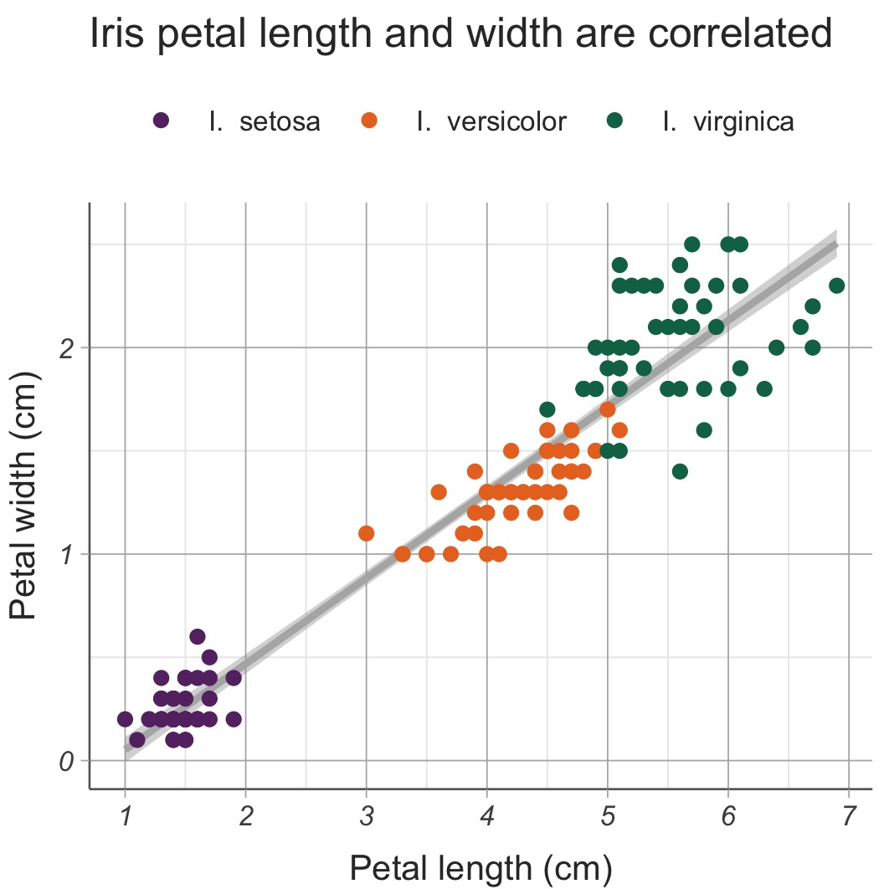

```{r setup, include = FALSE}
knitr::opts_chunk$set(echo = TRUE, warning = FALSE, message = FALSE)
```

A key part of our job as research scientists is to communicate our findings to a broader audience, including through papers, presentations, and conference posters. This means we routinely make and re-make figures which illustrate our work and any uncertainties associated with it. Data visualisation is a part of data science that we all engage with, regardless of our field of expertise. 

This is why I believe it is important that making figures isn't painful and confusing, but rather that it's something we approach systematically and with a level of confidence. With this tutorial I want to introduce you to the way I think about figure prototyping, i.e. the process of building and refining figures. To do so, I'll use one of the most popular software packages for data visualisation, `ggplot2`. There are two reasons for this: firstly, it's ~~cool~~ incredibly powerful and versatile, and secondly, it explicitly follows a layered *grammar of graphics*. This grammar provides a systematic way of thinking and describing the components of a figure.

The tutorial will have three parts. First, we will discuss the grammar of graphics. This part will be entirely code-free, but will hopefully help demystify the code to come. Then we will move on to a proper, reasonably extensive `ggplot2` tutorial, showcasing some of the most commonly used features. Finally, we will go through a figure prototyping example to illustrate how a complex figure is built line-by-line. But before we jump into it, let's set up.

## Materials and set-up

You should have R and RStudio installed for this tutorial. If not, first go to [CRAN](https://cran.r-project.org/) to download and install R, and afterwards head to the RStudio [website](https://www.rstudio.com/).

This R Markdown notebook was written in `R 4.1.3`. You can check your version by typing `version$version.string` in `R`. There are different ways of updating `R` if you need to. I'm fond of [`updateR()`](https://www.rdocumentation.org/packages/installr/versions/0.23.2/topics/updateR) from the `installr` package.

The packages we will use for this tutorial are `tidyverse` (which contains `ggplot2`) and `cowplot`, from which we will use `plot_grid()` in order to make compound figures. You can install or update packages in the usual way if you need to.
```{r install, eval = FALSE}
install.packages("tidyverse")
install.packages("cowplot")
```

Once you have everything installed and updated, we need to load the packages.
```{r packages}
library("tidyverse")
library("cowplot")
```

Finally, throughout this tutorial I will use [Fisher's iris data set](https://en.wikipedia.org/wiki/Iris_flower_data_set). This famous toy data set contains petal and sepal measurements obtained from 150 individual flowers across three iris species. It might be familiar to you from other workshops and tutorials, but don't worry if not. We can load it and take a look.

```{r load_iris_data}
data(iris)
head(iris)
```

## What is the Grammar of Graphics?

The "gg" in `ggplot2` stands for "grammar of graphics". If the grammar of a language is a way of describing the components of a sentence, e.g. subject, verb, object, and how they fit together, then a grammar of graphics is a way of describing the components of a plot, e.g. data, axes, shapes. Just like grammar differs from language to language, so it can differ from one data visualisation tool to another. However, when people talk about *the* grammar of graphics, they usually mean the grammar first described by [Leland Wilkinson](https://link.springer.com/book/10.1007/0-387-28695-0) and later extended and implemented by [Hadley Wickham](https://vita.had.co.nz/papers/layered-grammar.html).

The basic idea behind this grammar is that we can (semi-)independently specify plot building blocks and combine them to create arbitrarily complex figures. The three types of blocks we must explicitly specify for every `ggplot2` figure are **data**, **aesthetic mapping(s)** and **geometric object(s)**. Other blocks, usually handled by default in the background, include statistical transformations, scales, a coordinate system, faceting, and theme.

Let's illustrate the grammar of graphics. I made the plot below using `ggplot2`, although in principle I could have used base R, Excel, Prism, or even drawn it by hand. However a figure has been generated, we can always talk about it in terms of the grammar of graphics, even if we don't see the code used to make it, or if in fact there is no code.

{width=50%}

The **data** you see plotted above is the same iris data set I showed you earlier. While you have seen that the full data set contains a number of different measurements, only petal length and species are shown here.

The **aesthetic mappings** of the plot link these measurements to plot elements like axes, colours, shapes, and sizes. In the plot above, there are two aesthetic mappings: petal length is mapped to the x-axis, and species is mapped to colour (or technically, fill). What about the y-axis? It stands for count, which is not a measurement recorded in the data, but is instead calculated implicitly when making the plot. This is why it doesn't count (pun intended) as an aesthetic mapping. If you are trying to figure out what the aesthetic mappings of a plot are, you need to ask yourself (1) what measurements are present in the plot, and (2) how they are represented using axes, colours, and so on.

Finally, **geometric objects** describe the types of common statistical plots you see. They can be things like bar charts, scatter plots, box plots, etc. One of the features which make `ggplot2` so versatile is that it allows us to layer different geometric objects  on top of each other to make one complex figure. In the example above I used only one geometric object: a histogram. In order to identify the geometric objects in a plot, you have to ask yourself what common different types of plots you can see. Keep in mind there might be more than one!

**Exercise 1: The Grammar of Graphics.** Now that you have an idea of what data, aesthetic mappings, and geometric objects are in the context of the grammar of graphics, why don't you give it a try? Can you identify the different "building blocks" of the plot below? If you wish to spend longer on this exercise, try doing the same for the figures in the last research article you read. Alternatively, head over to your favourite news website and see if you can find some data visualisations there to practise on. Articles on the climate emergency, demographics, and elections are all good places to look.

{width=50%}

## `ggplot()` syntax overview

We have discussed the grammar of graphics in theory, but what does it look like as code? In its simplest form, the code to make a `ggplot2` figure looks something like this:

```{r pseudo_general, eval = FALSE}
ggplot(<data>, aes(<aesthetic mappings>)) +
  geom_<object>()
```

The first plot we discussed was a histogram of petal lengths, coloured by iris species. I added a title and used a few other features to customise my plot, but a simple version of the same figure can be generated using:

```{r pseudo_ex1, eval = FALSE}
ggplot(iris, aes(x = Petal.Length, fill = Species)) +
  geom_histogram()
```

Unlike plotting in base R, the **data** used in `ggplot()` must be in a data frame format. Like in `iris`, rows should always correspond to different samples, and columns should correspond to different measurements. Luckily for us, this is arguably the most standard way to record data, and you might find a lot of your spreadsheets already look like this.

The reason to insist on this format is that we can then set **aesthetic mappings** by referring to the column names of the data frame. Above, `x = Petal.Length` means that the measurements recorded  in `iris$Petal.Length` should go on the x-axis. Similarly, `fill = Species` means that the fill (i.e. inside colour of a 2D object, as opposed to its boundary colour) is determined by `iris$Species`.

Finally, the **geometric object** here, affectionately known as a geom, is a histogram. This is why it is written as `geom_histogram()`. Good code is pretty self-explanatory like that.

There are several differences between the very first plot I showed you and the "default" plot you will get running the two lines of code above. Let's put them side by side to compare and contrast. The plot on the left is the one I showed you earlier, and the plot on the right is the result of the two lines of code above.

{width=100%}
The data, aesthetic mappings, and geometric objects in both plots are exactly the same. The differences you see are purely stylistic, and are controlled by some of the optional features of `ggplot2`. Some geoms have extra parameters you can tweak, including **statistical transformations** and position. I manually set the histogram bins in my plot to be different from the default, and also made the histograms corresponding to different species overlap instead of stacking on top of each other. I then edited the **scales** of the plot, in order to change the axis labels and histogram colours. I also used a different **theme** which is why the background colours, fonts, and legend positions in the two plots are different. Finally, I also added a title to my plot. 

Throughout the rest of the tutorial, we will dig a little deeper into all these plot elements and a couple of others. Some things we won't have time to cover in great detail (e.g. colour palettes and creating your own custom themes), but I'll signpost you to other resources you can read.

## Aesthetic mappings and geometric objects

The connection between aesthetic mappings and geometric objects isn't entirely straightforward. They are not independent of each other: we usually specify both the x- and the y-axis for a scatter plot, but only the x-axis for a histogram. But neither are aesthetic mappings specific to a geom. When we make a complex figure including multiple geoms (e.g. a scatter plot together with a regression line), they might share some aesthetics, e.g. the x- and y-axis, but not others, e.g. colour. 

As a general rule, every geom will have some required aesthetics, some it complains about or ignores, and some that are optional. You don't need to know these by heart. Most of the time the obvious things work, and troubleshooting tends to be reasonably straightforward. However, it helps to be aware of the most commonly used aesthetics you can toggle.

### Aesthetics

#### Axes

The two major aesthetics are the axes, `x` and `y`. Axes can map to both continuous variables, such as `Petal.Length`, or discrete ones, such as `Species`. Below is a boxplot which illustrates both.

``` {r cont_disc}
ggplot(iris, aes(x = Species, y = Petal.Length)) +
  geom_boxplot()
```

#### Colour and fill

The other most commonly used aesthetics are for `colour` and `fill`. Here, `colour` stands for the colour of one-dimensional "thin" shapes such as points and lines, as well as the border colour of 2D shapes like bars and tiles. Fill stands for the "inside" colour of bars and tiles, as well as the shading of areas more generally. Scatter plots can have a `colour` mapping but will ignore `fill`, as points don't have an inside area to fill.

``` {r col_ex_point}
ggplot(iris, aes(x = Petal.Length, y = Petal.Width, colour = Species)) +
  geom_point()
ggplot(iris, aes(x = Petal.Length, y = Petal.Width, fill = Species)) +
  geom_point()
```

Meanwhile, histograms and boxplots can have both `colour` and `fill` mappings, although usually we want to focus on fill.

``` {r col_ex_hist}
ggplot(iris, aes(x = Petal.Length, colour = Species)) +
  geom_histogram()
ggplot(iris, aes(x = Petal.Length, fill = Species)) +
  geom_histogram()
```

Like axes, colours can map to both discrete variables, as above, or continous ones. By default, low values start in dark blue and gradually turn lighter, but later we will see how to fine-tune this gradient.

``` {r col_ex_point2}
ggplot(iris, aes(x = Petal.Length, y = Petal.Width, colour = Sepal.Length)) +
  geom_point()
```

#### Shape and linetype

It is often a good idea to make figures colourblind-friendly and suitbale for black and white printing, and the easiest way to do this is to change the shapes of points and lines. Point shape are given by `shape` and line type is given by, you guessed it, `linetype`. Below is an example which uses different colour and shape simultaneously. 

``` {r shape_ex}
ggplot(iris, aes(x = Petal.Length, y = Petal.Width, colour = Species, shape = Species)) +
  geom_point()
```

#### Aesthetic mapping vs aesthetic assignment

So far we have talked about aesthetic mappings, i.e. linking a particular aesthetic to a variable in the data. But occasionally you may want to keep aesthetics fixed to a particular value. For example, you might want to make a scatter plot with cornflower blue points, instead of colouring the points by species. We can set this using the same aesthetic `colour`, but moving it from the `aes()` call to the geom instead.

``` {r assign_ex_1}
ggplot(iris, aes(x = Petal.Length, y = Petal.Width, shape = Species)) +
  geom_point(colour = "cornflowerblue")
```

This is no longer and aesthetic _mapping_, since we are not mapping any data variables. Instead, it is an aesthetic _assignment_, as we are assigning a fixed value. There are some aesthetics I assign more often than others: `size`, which controls point size and line width, and `alpha` for colour transparency.

This is just the tip of the iceberg, of course. If you want to learn more, especially about different point shapes, line types and the like, check out this official documentation [page](https://ggplot2.tidyverse.org/articles/ggplot2-specs.html).

### Layering geometric objects

So far we have seen three types of geometric objects: histograms `geom_histogram()`, scatter plots `geom_point()` and boxplots `geom_boxplot()`. Listing all geoms is well beyond the scope of this tutorial, and if I'm being honest beyond the scope of my own knowledge. Suffice it to say, there is a geom for just about any commonly used type of statistical plot out there. Instead, here I'll give some examples of commonly used geoms and how they can be combined.

#### Layering

You might have noticed that right at the start I referred to the grammar of graphics as "layered". This refers to our ability to add geoms together and layer them on top of each other. One of the things I frequently do is make violin plots and add small boxplots inside them, to visualise the median and upper and lower quartiles of each distribution.

```{r layer_comb}
ggplot(iris, aes(x = Species, y = Petal.Length)) +
  geom_violin() +
  geom_boxplot(width = .15)
```

If you've ever used an image editing tool like Photoshop, Inkscape, or Gimp, you might be familiar with the concept of layering. It's this idea that when you put opaque images on top of each other, bottom layers are hidden underneath top layers. We can control this by adjusting layer transparency and being careful about how we order things. In `ggplot2`, geoms are layered in the order you type them, i.e. earlier geoms appear under later ones. This means that the large violin plots are below the small box plots. However, if I swapped the order of the geoms above, the boxplots will no longer be visible because they remain hidden behind the violins.

```{r layer_comb_2}
ggplot(iris, aes(x = Species, y = Petal.Length)) +
  geom_boxplot(width = .15) +
  geom_violin()
```

**Exercise 2: Layering.** Another way to make sure background layers are visible is by making foreground layers transparent. Can you edit just the last line of the code above (reordering geoms or adding new ones is not allowed) to make this picture?
```{r layer_comb_3, echo = FALSE}
ggplot(iris, aes(x = Species, y = Petal.Length)) +
  geom_boxplot(width = .15) +
  geom_violin(alpha = 0.25)
```

#### Shared and private aesthetics

In the example above, the violin plots and the box plot shared the same aesthetic mappings, namely species for the x-axis and petal length for the y-axis. Axes are usually shared by all geoms in a plot. However, aesthetics don't have to be shared all the time. It is quite common to share some aesthetics and keep others private to specific geoms.

For example, suppose that I wanted to colour the violin plots by species, but keep the boxplots white for contrast. If I add `fill = Species` in my usual `aes()` call, I end up colouring both, which isn't what I set out to do.

```{r share_ex}
ggplot(iris, aes(x = Species, y = Petal.Length, fill = Species)) +
  geom_violin() +
  geom_boxplot(width = .15)
```

This is because anything from the `aes()` inside the `ggplot()` function gets passed down to all geometric objects underneath.  These are all shared aesthetics. However, I can add a new `aes()` mapping that is private just to one geom only: it will affect that specific geom, but nothing else. If I set `aes(fill = Species)` to be private to `geom_violin()`, then it wouldn't affect the boxplot, which would remain white by default.

```{r share_ex_2}
ggplot(iris, aes(x = Species, y = Petal.Length)) +
  geom_violin(aes(fill = Species)) +
  geom_boxplot(width = .15)
```

**Exercise 3: Shared and private aesthetics.** It is completely and shamelessly unjustifiable stylistically, but can you make the picture below?
```{r share_ex_3, echo = FALSE}
ggplot(iris, aes(x = Species, y = Petal.Length)) +
  geom_violin(aes(colour = Species)) +
  geom_boxplot(width = .15, aes(fill = Species))
```

### Fine-tuning geoms

Data visualisation is ultimately a branch of statistics and like all branches of statistics, it (unfortunately) requires some maths to be done, if not by us, then by the computer. And different types of plots, i.e. different geoms, require different calculations.

A scatter plot `geom_point()` is easy: we take the data as it is, no maths necessary. A histogram `geom_histogram()` is, however, more involved: we need to decide how to bin the data, and then count how many points fall in each bin. Therefore, it makes sense for us to be able to set things like binwidth or breakpoints in a histogram. In order to get the right height and shape boxplot `geom_boxplot()` we need to calculate the median and interquartile range of the data, instead of binning it. A violin plot `geom_violin()` may intuitively feel like a type of boxplot, but the maths behind it is different still: instead of quartiles, the shape of the distribution is estimated. Different geoms then require different _statistical transformations_.

#### Stats

This is where things get a little abstract and esoteric, apologies for which. At least I can hand-to-heart promise you're unlikely to ever need to worry about these too much.

Every geom has a default corresponding stat. There are properly `stat_*()` functions that handle the necessary statistical transformations, but most of the time we think of them as parameters in the `geom_*()` function. Since in `geom_point()` we leave the data as-is, its stat is `stat = "identity"`. In histograms, the default stat is `stat = "bin"`, because we need to bin the data. Etc., etc. 

What happens if we try to change the `stat` away from the default? Let's try. Below, I've used `geom_point()` but with the same stat that histograms require. What we end up with looks a bit like a histogram, except made of points instead of bars. That's because in `ggplot2`, the stat controls the calculation (in this case, binning data), and the geom controls the way it's visualised (in this case, using points).

```{r }
ggplot(iris, aes(x = Petal.Length, colour = Species)) +
  geom_point(stat = "bin")
```

Is changing stats ever actually useful? Yes, albeit very rarely. Most of the time, you'll find there is already a geom best suited to the stat you want. Still, understanding stats is important because (a) it makes navigating `ggplot2` documentation easier, and (b) you can look through which optional parameters you can adjust.

#### Additional parameters

Geoms have additional parameters you can tweak, some of which they inherit from the underlying stat. We used one such parameter earlier: `width` can make things like boxplots and bars narrower. Try varying the value of width below to see what happens.

```{r eval = FALSE}
ggplot(iris, aes(x = Species, y = Petal.Length)) +
  geom_violin() +
  geom_boxplot(width = 0.15)
```

The default way `stat_bin()` works is by binning data into 30 equally-sizes bins. But we can fix the number of bins with `bins`, their width with `binwidth`, or create variable bins by setting their boundaries with `breaks`. This is particularly useful when we make histograms. Note that while it's technically the stat that does the calculation, and so uses the bin parameters, I put them directly in `geom_histogram()`, without worrying about the rest. 

```{r}
ggplot(iris, aes(x = Petal.Length, fill = Species)) +
  geom_histogram(binwidth = 0.25)
```

The other useful geom to know how tweak is one we haven't mentioned before: `geom_smooth()`. By default, it fits a curve through the data.
```{r}
ggplot(iris, aes(x = Petal.Length, y = Petal.Width)) +
  geom_point() +
  geom_smooth()
```

In the figure above, the blue curve is the fitted model, and the grey band is its 95% confidence interval. The model in question is LOESS, a kind of local polynomial regression that you might not be familiar with, or that might not be relevant to the statistical analysis you actually do on your data. Much more often, we want to specify a linear model instead, which we can do using the `method` parameter.

```{r}
ggplot(iris, aes(x = Petal.Length, y = Petal.Width)) +
  geom_point() +
  geom_smooth(method = "lm")
```

By default, a linear model plotted like that fits `lm(y ~ x)`. However, we can specify the formula if we wanted to. Note the `formula` parameter uses the aesthetics we have mapped (in this case the axes `x` and `y`), not the data variable names. We can also hide the confidence interval by setting `se = FALSE` or make it wider, by setting another value, e.g. `se = .90` for a 90% confidence interval

```{r}
ggplot(iris, aes(x = Petal.Length, y = Petal.Width)) +
  geom_point() +
  geom_smooth(method = "lm", formula = y ~ sqrt(x), se = .90)
```

**Exercise 4: Smoothers.** Can you make the figure below? 
```{r share_ex_4, echo = FALSE}
ggplot(iris, aes(x = Petal.Length, y = Petal.Width)) +
  geom_smooth(method = "lm", colour = "grey20") +
  geom_point(aes(colour = Species))
```

#### Position

In addition to having a stat, which handles relevant calculations, geoms also have a position, which ostensibly handles what happens when parts of the geom overlap. This usually happens when we have overlapping data points, and it is most often important when we make histograms. Let's deviate from our iris dataset for a minute.

```{r}
df <- data.frame(value = rep(1:2, 8),
                 label = rep(c("A", "B"), times = c(10, 6)))
head(df)
```
The data above contains 16 measurements, each equal to 1 or 2, and labelled either A or B. There are 10 A's (5 1s and 5 2s) and 6 Bs (3 1as and 3 2s). Let's make a histogram of the data, colouring it by label, The default position of histograms is `position = "stack"`, meaning equal values appear on top of each other. This is why we see two columns, each of height 8. 

```{r}
ggplot(df, aes(x = value, fill = label)) +
  geom_histogram()
```

However, most of the time when we plot histograms and colour them by some category, we expect them to overlap instead of stack. To overlap, we must set `position = "identity"`. This way, the two columns are of size 5 (for A) and 3 (for B). B is plotted in front of A.

```{r}
ggplot(df, aes(x = value, fill = label)) +
  geom_histogram(position = "identity")
```

We might also want to plot the data side by side. This is rather ill-advised for histograms, but it can be very useful in bar charts `geom_bar`.

```{r}
ggplot(df, aes(x = value, fill = label)) +
  geom_bar(position = "dodge")
```

**Exercise 5: Positions.** Can you make the figure below? 
```{r share_ex_5, echo = FALSE}
ggplot(iris, aes(x = Petal.Length, fill = Species)) +
  geom_histogram(alpha = 0.5, position = "identity")
```

## Faceting

So far we have discussed colour as a way of distinguishing between discrete groups in the data, e.g. iris species. However, sometimes it is clearer and more preferable to create a separate plot for each group. This is particularly true when there are many groups.

Splitting a plot by group is known as _faceting_. There are two ways of faceting: `facet_grid()` and `facet_wrap()`. As the name suggests, the former creates a grid, and is particularly useful when we are faceting by two variables. The latter is designed for faceting by one variable, and will wrap the plots so they fall in a roughly rectangular shape.

The syntax of `facet_*()` is a bit unusual: `facet_wrap(~<var>)` for one variable, and `facet_grid(<var_rows> ~ <var_cols>)` for two variables in a grid. So if we wanted to split the petal length histogram by species, we would write:
```{r}
ggplot(iris, aes(x = Petal.Length)) +
  facet_wrap(~Species) +
  geom_histogram()
```

Variables can be column names of the data, but like aesthetics, they can also be expressions. Let's say I want to split the histograms by species _and_ by petal width, so flowers with petal width below 1.5cm are in one group, and above are in another.

```{r}
ggplot(iris, aes(x = Petal.Length)) +
  facet_grid((Petal.Width >= 1.5) ~ Species) +
  geom_histogram()
```

Above, `FALSE` and `TRUE` refer to the statement `Petal.Width >= 1.5`: flowers with narrower petals are in the top row, and flowers with wide petals are in the bottom row. We can clarify this in the labels by adding a labeller. A labeller is a function which connects the variable values (in this case `FALSE` and `TRUE`) with the labels we would like to see printed on the screen (e.g. `narrow` and `wide`).

We first start by defining the labels as named arrays. The names of the array elements should correspond to values of the faceted variables, like so:
```{r}
width_labs <- c("TRUE" = "Wide petals", "FALSE" = "Narrow petals")
species_labs <- c("setosa" = "I. setosa", "versicolor" = "I. versicolor", "virginica" = "I. virginica")
```

The labeller function then links these arrays to the faceted variables. There are two ways of writing a labeller: using `.row` and `.col` to link the labels to rows and columns, respectively, or using variable names directly. Below, you can see `.row` used for the petal width distiniction, and `Species` used instead of `.col`:

```{r}
ggplot(iris, aes(x = Petal.Length)) +
  facet_grid((Petal.Width >= 1.5) ~ Species, labeller = labeller(.rows = width_labs, Species = species_labs)) +
  geom_histogram()
```

## Scales

This might seem like a lot of work, and it is unusually so. With the exception of facet, most label printing, colour setting, etc., is done somewhat more straightfowrardly by _scales_. Scales control aesthetic mappings, and take the format of `scale_<aesthetic>_<type>()`. So if I want to format the discrete x-axis, I would add `scale_x_discrete()` to my plot. Every aesthetic has a scale, and scale types can vary considerably: I tend to use `discrete` and `continuous` for axes, and `manual` for colour. The latter allows me to set specific colours.

Some elements are common to a lot of scales. The `name` or the first argument of the aesthetic will serve as its axis or legend title. If the scale is numeric, `limits` set the range of values printed, and `breaks` are the points where we see labels printed. These labels are handled by a `label` option (and not a labeller, unlike facets!). Finally, you can set specific values with, you guessed it, `values`. Here are these all in action:

```{r}
ggplot(iris, aes(x = Species, y = Petal.Length, fill = Species)) +
  geom_boxplot() +
  scale_x_discrete("Species", labels = species_labs) +
  scale_y_continuous("Petal Length", limits = c(0, 8), breaks = 1:7) +
  scale_fill_manual("", values = c("virginica" = "red", "setosa" = "blue", "versicolor" = "yellow"),
                    labels = species_labs)
```

**Exercise 6: Scales.** Can you make the figure below? To get these exact colours, I used the Java palette from the `MetBrewer` package, but more on that later. For now you can just copy them from here:
```{r}
species_cols <- c("setosa" = "#663171", "versicolor" = "#ea7428", "virginica" = "#0c7156")
```

```{r share_ex_6, echo = FALSE}
ggplot(iris, aes(x = Petal.Length, y = Petal.Width)) +
  geom_smooth(method = "lm", colour = "grey70") +
  geom_point(aes(colour = Species)) +
  scale_x_continuous("Petal length (cm)", breaks = 0:7) +
  scale_y_continuous("Petal width (cm)", breaks = 0:3) +
  scale_colour_manual("Species", values = species_cols, labels = species_labs)
```

## Themes

Scales control for aesthetic mappings, but there are design choices that go in a figure that are static and unrelated to aesthetics at all. Background colour, text font, and legend position all fall into this category. These features are all controlled by the theme in a plot.

There are some themes already built into `ggplot2`. Among them are the default `theme_gray()`, its black & white equivalent `theme_bw`, and `theme_classic()` which you might recognise especially from scientific publications. Here is an example of the same plot using each of these three themes. Note that I can save the plot as a variable `p`, and then just add the relevant theme `p +  theme_*`.

```{r}
p <- ggplot(iris, aes(x = Petal.Length, y = Petal.Width, colour = Species)) +
  geom_point()
p
p + theme_bw()
p + theme_classic()
```

If you're looking for something a bit jazzier, I recommend the `ggthemes` package (LINK), which includes themes inspired by designs from The Economist, FiveThirtyEight, and Tufte, among others.

We can also write our own custom themes. It would be beyond the scope of this tutorial to explain all the features of a theme and how they can be altered. If you'd like a challenge, I recommend this [doc page](https://ggplot2.tidyverse.org/reference/theme.html). A great way to browse through custom themes and see how people tweak them is through the #TidyTuesday project (see below).

For now, I will introduce you to two theme parameters I think are particularly important: base size and legend position. Base size is the default font size of a theme and also affects line and rectangle sizes. This is useful, because you can make a plot printer-friendly for any format, from single column width, to A1 poster size. 

Legend position is another useful feature to know your way around. If you use the same colour scheme in multiple subfigures you might want the legend visible in only one of them. Alternatively, you might want to move the legend position away from its default (usually to the right) and somewhere else, e.g. the top or the bottom of the figure. These are all controlled by the `legend.position` parameter, which can take values `"none"`, `"left"`, `"right"`, `"bottom"`, or `"top"`.

The default base size is 11, which is good for print. The default legend position can vary from theme to theme, but it is usually on the right. Below is an example of a plot with larger fonts and legend moved to the top. Note how while the `base_size` parameter is an argument of `theme_classic()`, the legend position goes in its own `theme()` function.

```{r}
p + theme_classic(base_size = 18) + theme(legend.position = "top")
```

The typical way of defining themes is by starting from a fairly minimal theme, and adding to it additional parameters. A variation on the theme I use in my day-to-day work is this:

```{r}
theme_lvb <- theme_minimal(base_size = 10) +
  theme(
    text = element_text(color = "gray20"),
    # Legend
    legend.position = "top",
    legend.direction = "horizontal",
    legend.justification = 0.1,
    legend.title = element_blank(),
    # Axes
    axis.text = element_text(face = "italic"),
    axis.title.x = element_text(vjust = -1),        
    axis.title.y = element_text(vjust = 2),
    axis.ticks.x = element_line(color = "gray40", size = 0.3),
    axis.ticks.y = element_blank(),
    axis.line = element_line(color = "gray40", size = 0.3),
    axis.line.y = element_blank(),
    # Panel
    panel.grid.major = element_line(color = "gray40", size = 0.5),
    panel.grid.major.x = element_blank())
```

It is a fair amount of tweaking and setting parameters, but the good news is once you set up a theme you like, you can use it in pretty much any plot.

```{r}
p + theme_lvb
```

## Tweaks

With this we have now covered most of ggplot's main features. What's left is final touches: how to add titles and other annotation, how to put multiple figures in a single plot, and how to (automatically) save figures with sensible resolution, size, and file type. 
  
### Annotation

In presentations, less so than in publications, it helps to give figures titles and occasionally subtitles, which can be done using `ggtitle()`. Sometimes you might also  want to annotate a particular part of the plot with additional text. This is done using _annotation layers_. For a full description, head over to the [docs](https://ggplot2.tidyverse.org/reference/annotate.html). Below is an example using both a rectangle highlight and some text.

```{r}
p + 
  ggtitle("Title", subtitle = "Optional descriptive subtitle") +
  annotate("rect", xmin = 0.8, xmax = 2.1, ymin = 0, ymax = .7, alpha = 0.2) +
  annotate("text", x = 1.5, y = 0.85, label = "smaller flowers")
```

### Compound figures

If annotations might be more useful in presentations, then creating labelled subfigures is incredibly important for papers, and particularly for experimental papers. So far we have only really used `ggplot` features. This is where `cowplot` comes in very handy!

In its simplest form, `plot_grid()` allows us to create rectangular grids, including giving them labels. Note the labels are size 14 by default, you might want to reduce them!

```{r}
q1 <- ggplot(iris, aes(x = Species, y = Petal.Length)) + geom_boxplot()
q2 <- ggplot(iris, aes(x = Species, y = Petal.Width)) + geom_boxplot()
plot_grid(q1, q2, labels = c("A", "B"), label_size = 12)
```

Unfortunately, `plot_grid` can only create rectangular grids of plots. But we can add plot grids inside other plot grids, to make more complicated compound plots. We can also control the relative widths and heights of the plots with respect to each other.

```{r}
p <- ggplot(iris, aes(x = Petal.Length, y = Petal.Width)) + geom_point()

q <- plot_grid(q1, q2, labels = c("B", "C"), label_size = 12)

plot_grid(p, q, nrow = 2, labels = c("A", ""), label_size = 12, rel_heights = c(2, 1))
```

In the plot above, I first put the two box plots together in their own grid, and then I put that grid below the scatter plot. I also increased the relative height of the scatter plot to be twice that of the box plots.

**Exercise 7: Putting it all together.** We have done a full circle! Can you make the figure below?

```{r, echo = FALSE}
p1 <- ggplot(iris, aes(x = Petal.Length, fill = Species)) +
  theme_lvb + theme(legend.position = "none") +
  geom_histogram(position = "identity", alpha = 0.7, binwidth = .25) +
  scale_x_continuous("Petal length (cm)", breaks = 0:7) +
  scale_y_continuous("Count") +
  scale_fill_manual("Species", values = species_cols, labels = species_labs)
p2 <- ggplot(iris, aes(x = Petal.Width, fill = Species)) +
  theme_lvb + theme(legend.position = "none") +
  geom_histogram(position = "identity", alpha = 0.7, binwidth = .25) +
  scale_x_continuous("Petal width (cm)", breaks = 0:3) +
  scale_y_continuous("Count") +
  scale_fill_manual("Species", values = species_cols, labels = species_labs)
q <- ggplot(iris, aes(x = Petal.Length, y = Petal.Width)) +
  theme_lvb +
  geom_smooth(method = "lm", colour = "grey70") +
  geom_point(aes(colour = Species)) +
  scale_x_continuous("Petal length (cm)", breaks = 0:7) +
  scale_y_continuous("Petal width (cm)", breaks = 0:3) +
  scale_colour_manual("Species", values = species_cols, labels = species_labs)

p <- plot_grid(p1, p2, ncol = 1, labels = c("B", "C"), label_size = 11)
plot_grid(q, p, nrow =1, labels = c("A", ""), label_size = 11)
```

### Saving figures

All that is left now is to save our figure to file. Figures you generate usually appear at the bottom right of RStudio, under the *Plots* tab. The easiest way to save them is to click on **Export > Save as Image...**, and set the file format and size of the figure before saving it to file.

Is there a better way? Yes. The `ggsave()` function does exactly that, and even lets you fix the resolution (defaults to the standard print DPI = 300). In case like me, you get confused about conversions between units (inch, cm / mm, or px) and end up looking it up every time, a full text width / two-column image should have width 190mm, allowing for a 1cm page margin on each side. For single-column images, you should aim for width of 90mm. As a pro tip, always set the width and the desired aspect ratio first, then calculate the height of a figure as `height = width / aspect_ratio`.

To make my life a bit easier, I have written myself a function to do this automatically. I use the same function across all of my projects, the same way I use the same ggplot theme over and over again. It has two required parameters: a ggplot object (grids work too!) `p`, and a file name `filename`. It has an optional parameter `size` which should typically be between 0 and 1, where one is "full-size" and 0.5 is "single-column", and `ar` as the (width-to-height) aspect ratio. The file format is set by `dev`. I most often use `jpeg` but for journal submission you might want to change that to `eps`, or `pdf`.

```{r}
plot_save <- function(p, filename, size = 1, ar = 1, dev = "jpeg"){
  allowed_devs <- c("eps", "ps", "tex", "pdf", "jpeg", 
                    "tiff", "png", "bmp", "svg")
  if (!(dev %in% allowed_devs))
    stop("Invalid device.")
  if (dev != "jpeg" & !str_detect(filename, paste0("\\.", dev)))
    filename <- paste0(filename, ".", dev)
  if (dev == "jpeg" & !str_detect(filename, "\\.jpg|\\.jpeg"))
    filename <- paste0(filename, ".jpg")
  w <- round(190 * size)
  h <- w/ar
  ggsave(filename = filename,
         plot = p,
         width = w,
         height = h,
         units = "mm",
         device = dev)
}
```

All that's left to do is save our figure: `plot_save(p, "my_plot.jpg", size = 1, ar = 4/3)`. And we're done!

## Final thoughts and further reading

As you have seen, making figures is an iterative process done line by line and tweak by tweak. In the tutorial above we covered how to think about plots, and how to build them by starting from their core components (aesthetic mapping and geometric objects), before adding flourish. However, we didn't cover code in any particular detail and there are many `ggplot2` features we did not mention, such as facets and statistical transformations. If you are curious to read more, here are some of my favourite resources.

On visualising in general, earlier I referenced a workshop by Sam Way and Dan Larremore. You can find the slides [here](https://drive.google.com/file/d/1LouVvISCRlWkItZgzoHcgoU5Q1VyHT4U/view). It contains some neat thoughts about how we communicate through data visualisations, and is completely code-agnostic.

If you are keen to learn more about `ggplot2`, the [book](https://ggplot2-book.org/) by Hadley Wickham *et. al* is the single most comprehensive resource out there. Like all `tidyverse` books, it is written in R Markdown (just like this tutorial!) and is completely free to read. If you don't have time for a full book or need a quick reference, check out the [cheat sheet](https://raw.githubusercontent.com/rstudio/cheatsheets/main/data-visualization.pdf).

If you want to see `ggplot2` used in the wild, Cédric Scherer has a great [blog](https://www.cedricscherer.com/top/about/) full of tips and examples. I also recommend looking up the #TidyTuesday project on [GitHub](https://github.com/rfordatascience/tidytuesday), and checking out the hashtag on [Twitter](https://twitter.com/search?q=%23TidyTuesday&src=typeahead_click)! It is an online community project, where every week a new dataset is released and people try to practise their `tidyverse` skills and learn something new by exploring unfamiliar data. In the spirit of the project everyone shares their code, so when you find a particularly good figure, you can learn from its author.

Going beyond the `tidyverse`, there are a number of other `ggplot2`-related packages. Here we used `cowplot`, which was developed to streamline plots for the Wilke lab. [Claus O. Wilke](https://clauswilke.com/) is one of the regular contributors to `tidyverse` and has also written and contributed to a number of other related packages. Another neat find is `bbplot`, which the BBC data team have developed to make the figures we see on the news! You can find a tutorial for how it all works [here](https://bbc.github.io/rcookbook/). I also love [`MetBrewer`](https://github.com/BlakeRMills/MetBrewer), which is a collection of colour paletts inspired by famous works of art.

This is all from me for now. Thanks for sticking around!

Lyuba